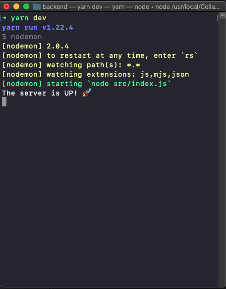
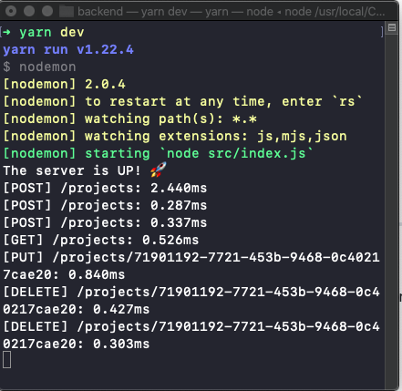

# Projects

Simple application to keep track of current projects.

#### Check out the Front-end: [Projects Front-End](https://github.com/Alvaro-Vargas/projects-frontEnd)

#### How to run the server:
1. Download the project
1. Run: `yarn dev`

You will see a message indicating that the server is up. 

---
### API Calls 🤖
#### GET
**url:** /projects  
**params:**
- No params necessary 

**response:** JSON > All projects

#### POST
**url:** /projects  
**params:**
- body: { "Title": example, "Owner": example};

**response:** JSON > New Project

#### PUT
**url:** /projects/:id  
**params:**
- params: id
- body: { "Title": example, "Owner": example};

**response:** JSON > Modified Project

#### DELETE
**url:** /projects/:id  
**params:**
- params: id

**response:** 204 - No Content

---

### Dependencies:
**cors**: Resolved the CORS error when calling the API from the frontend

**express**: Create the API 

**uuidv4**: Create Universally unique identifiers

---

Also, you will see the [**METHOD**], **/url** and **time** in ms for each call:

---

> *You are breathtaking!*

That's all (for now). Thanks for checking! 👨🏻‍💻